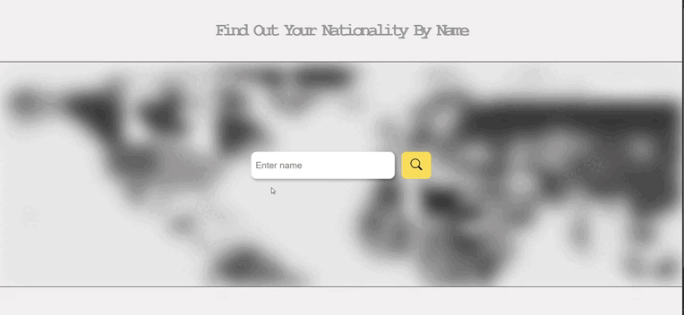

# FindOutNationalityByName 🔍️

**FindOutNationalityByName** — это веб-приложение, которое позволяет узнать вашу национальность по вашему имени и фамилии.
P.S Вы так же можете указать только ваше Имя, но ответ может быть не точным. 

***

## 🚀 Возможности

- 🔍 Поиск национальности по имени и фамилии

***

## 🛠️ Технологии
<p align="left">
<a href="https://developer.mozilla.org/en-US/docs/Web/JavaScript" target="_blank" rel="noreferrer"></a>
<a href="https://developer.mozilla.org/en-US/docs/Glossary/HTML5" target="_blank" rel="noreferrer"></a>
<a href="https://www.w3.org/TR/CSS/#css" target="_blank" rel="noreferrer"></a>
</p>

***

## 🔗 Пример запроса к API

Чтобы сделать запрос к  API, воспользуйтесь следующим примером:
  ```bash
https://api.nationalize.io/?name=Ваше_Имя
```

***

## 📸 Пример работы проекта
  <div align="center">
      
    </div>
